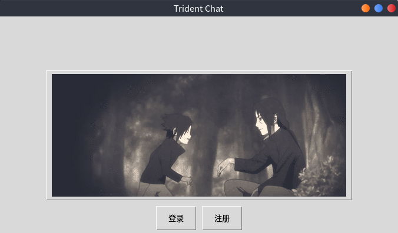
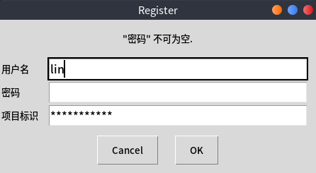
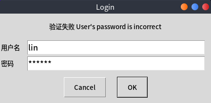
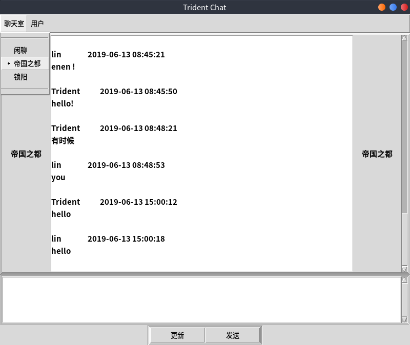
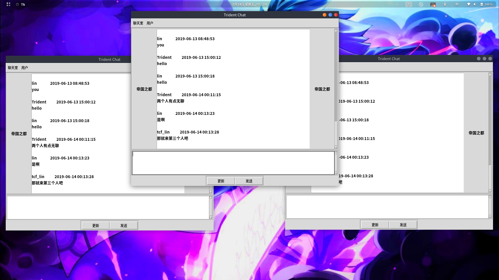
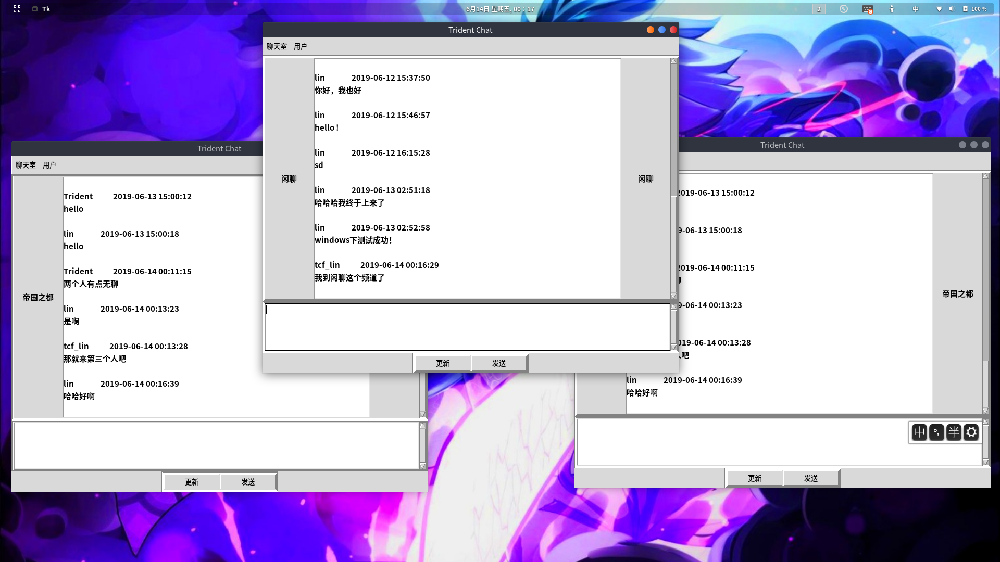
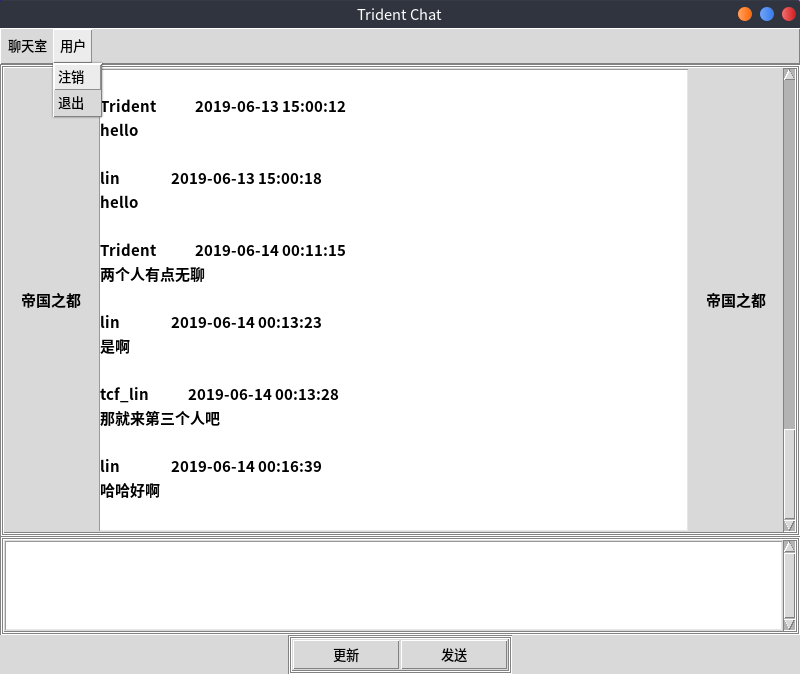

#### 基于MQTT的聊天室

##### 功能：

- 注册
- 登录
- 发送文字
- 退出

##### 详细描述：

- 注册功能，用户名、密码和服务暗号
- 登录，用户名、密码、进入群组，登录之后，服务器应该生成一个用用户名为key的token存入redis，有过期时间，将token发给用户
- 登录之后，可以在不同的聊天室间切换
- 发送文字，每次进入那个群组，能看到所有历史数据

##### 部署须知：

- 要求环境：python3、mysql、redis
- python3下载所需库：当前目录下pip3 install -r requirements
- 运行Server端：当前目录下python3 server_run.py
- 运行Client端：当前目录下python3 client_run.py
- 若是Server端要部署于服务器端，原则上只要在世界上某个地方有运行一个Server端，而且Server端与你的Client端使用的代理服务器是同一个ip地址和端口的服务器即可（服务器上需要配置好代理服务器，比如我用的是mosquitto）
- 若是要将代理服务器和数据库换成自己的配置，配置文件在config文件夹中，其中mysql数据库可以调用db_model/model_dao/base_model_dao.py中类的方法进行表的创建
- Server端也可以使用docker-compose进行部署，可以看docker-compose.yml

##### mysql数据库设计

- 用户表 user

|   参数   |    类型     | 是否必须 |   含义   |
| :------: | :---------: | :------: | :------: |
|    id    |     int     |    是    | 唯一标识 |
|   name   | varchar(20) |    是    |  用户名  |
| password | varchar(20) |    是    |   密码   |

- 聊天室 chat_rooms

| 参数 |    类型     | 是否必须 |   含义   |
| :--: | :---------: | :------: | :------: |
|  id  |     int     |    是    | 唯一标识 |
| name | varchar(20) |    是    |  用户名  |

- 聊天记录 chat_notes

|  参数   |     类型      | 是否必须 |      含义      |
| :-----: | :-----------: | :------: | :------------: |
|   id    |      int      |    是    |    唯一标识    |
| room_id |      int      |    是    | 聊天室唯一标识 |
| user_id |      int      |    是    |  用户唯一标识  |
| message | varchar(1024) |    否    |    聊天信息    |
|  time   |  varchar(20)  |    是    |    发布时间    |

##### 运行截图（Client端）

- 初始界面

- 注册、登录（若是失败会有提示信息）

- 进入聊天室，选择一个聊天室，就会更新以往的内容

- 多个用户进行聊天

- 不同聊天室不互通

- 用户可以注销退出，注销则回到登录界面

